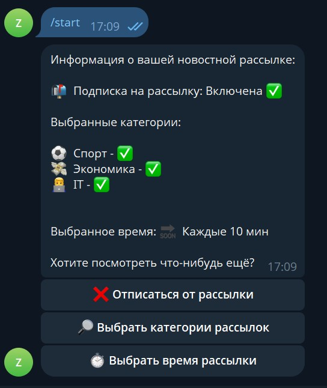

<h1 align="center">NewsBot</h1> 

  

## О боте
Реализация телеграм бота, который парсит новости из rss-агрегаторов, даёт возможность
выбрать категорию и периодичность отправки новостей, с возможностью отписаться/подписаться заново в любой момент. 
Бот умеет фильтровать новости по наличию описания и ссылки на новость, парсит и прикрепляет соответствующее к новости фото. 
Имеет интуитивно понятный интерфейс, с возможностью удалять новости после прочтения

## Используемые технологии
- Java 21;
- Spring Boot;
- Docker;
- Gradle;
- Git;
- JUnit 5 & Mockito
- Telegram bots.

## Пример работы

  
  

## Лицензия

Copyright (c) 2025 ZapolyarnyDev

Проект распространяется под лицензией MIT — см. файл [LICENSE](LICENSE) для подробностей.
